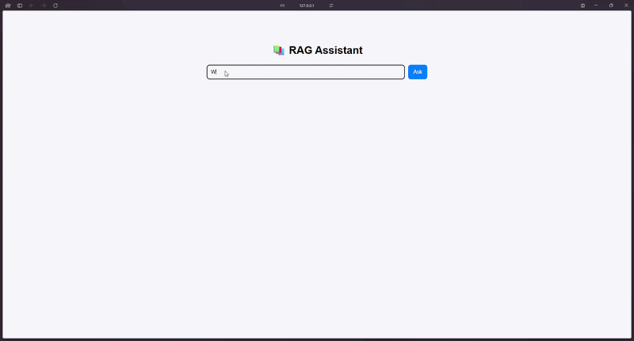
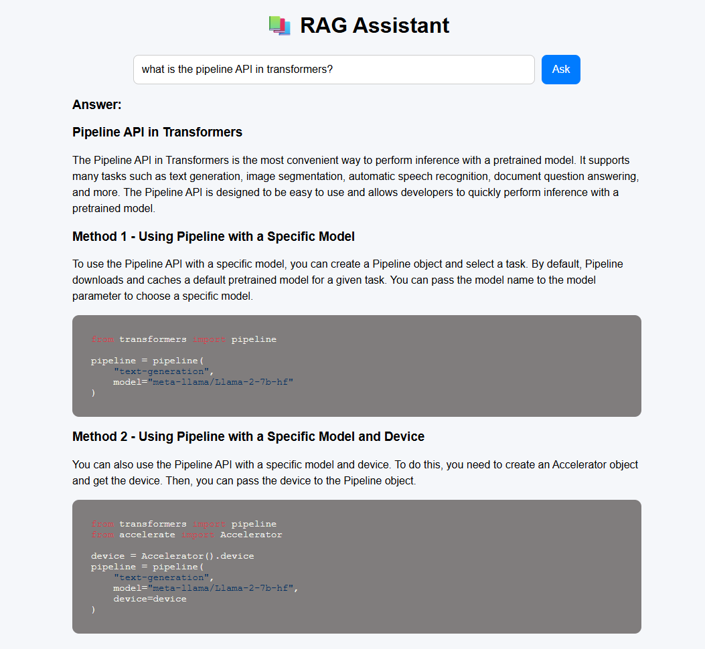
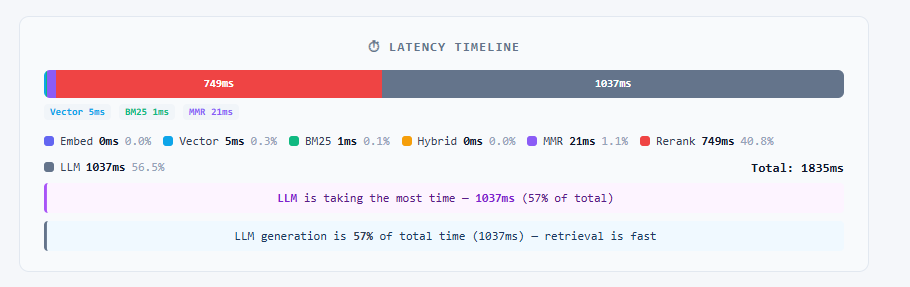
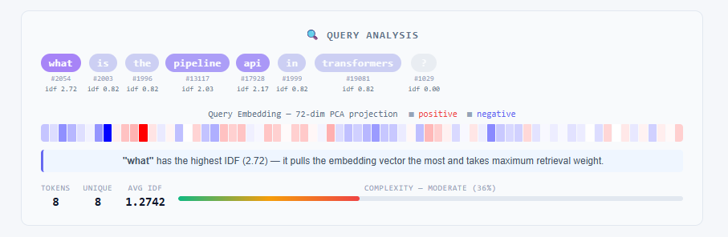
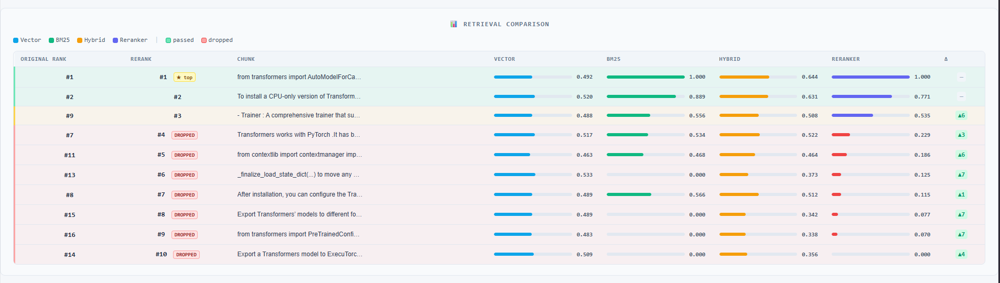
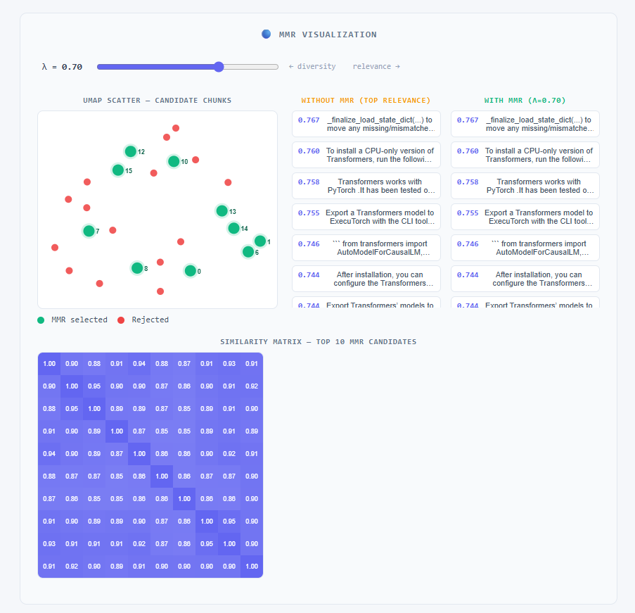
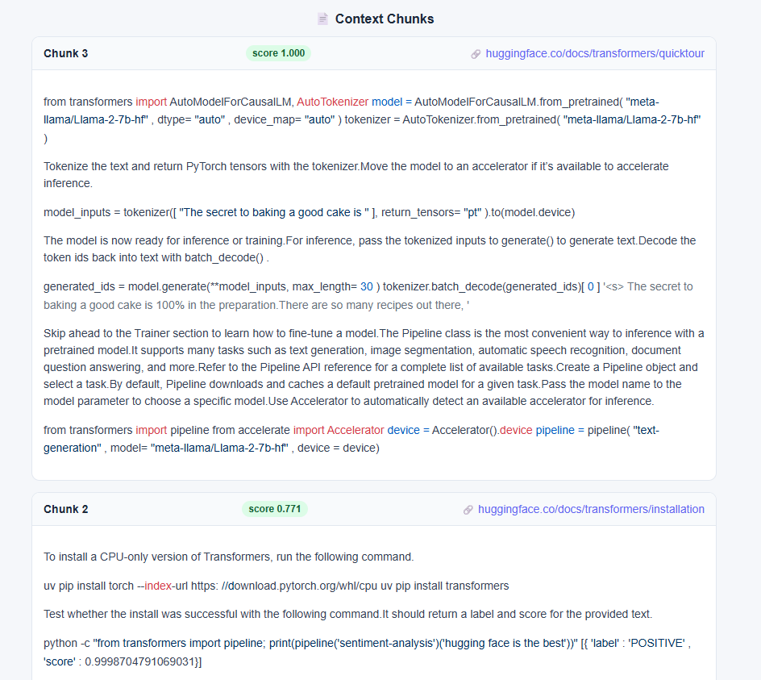

# Explainable RAG System


🔗 **[Live Demo](https://huggingface.co/spaces/Ilaa-1505/Explainable-RAG-System)**
> If the Space is sleeping, it may take ~30 seconds to wake up on first visit. Startup may also be slow as the embedding model and reranker weights load into memory.
> Groq free tier rate limits apply — if you get no response, wait a minute and try again.

Most RAG systems are black boxes. You type a question, get an answer, and have no idea what happened in between.

Which documents were retrieved. Why one chunk ranked above another. How the query was even interpreted.

This project opens that box. Every stage of the retrieval pipeline is visible and interactive:
- how your query gets tokenized and embedded
- how BM25 and vector search disagree
- how MMR trades off relevance for diversity
- why the reranker promotes some chunks and drops others

Ask a question. See exactly how the answer was built.

---

## Demo

> 

---

## What's inside

### Answer
Ask anything about the HuggingFace Transformers documentation. The system retrieves relevant chunks, reranks them, and generates an answer using Llama 3.1 via Groq.

> 

---

### Latency Timeline
Every stage of the pipeline: embed, vector search, BM25, hybrid fusion, MMR, rerank, LLM, broken down by time. You can see exactly where the bottleneck is.

Below it, query analysis shows each token's IDF score, its position in the embedding space, and an overall complexity rating.

> 
> 

---

### Retrieval Comparison
A table showing every candidate chunk with its Vector, BM25, Hybrid, and Reranker scores side by side. You can see which chunks got promoted, which got dropped, and by how much.

> 

---

### MMR Visualization
MMR (Maximal Marginal Relevance) balances relevance and diversity when selecting chunks. This tab shows that tradeoff visually, a UMAP scatter of all candidates, a similarity matrix, and a live λ slider to see how the selection changes in real time.

> 

---

### Context Chunks
The final chunks passed to the LLM, each with its reranker score and source URL.

> 

---

## Retrieval Pipeline

```
Query → Embed → Vector Search + BM25 → Hybrid Fusion → MMR → Rerank → LLM
```

- **Vector search** — BAAI/bge-small-en-v1.5 embeddings via ChromaDB
- **BM25** — keyword search with BM25Okapi
- **Hybrid fusion** — weighted combination of both (α = 0.7)
- **MMR** — removes redundant chunks while preserving relevance
- **Reranker** — cross-encoder/ms-marco-MiniLM-L-6-v2 for final scoring
- **LLM** — Llama 3.1 8B via Groq API

---

## Stack

- **Backend** — Flask
- **Embeddings** — sentence-transformers, ChromaDB
- **Retrieval** — rank-bm25, UMAP
- **Reranker** — CrossEncoder (ms-marco-MiniLM-L-6-v2)
- **LLM** — Llama 3.1 via Groq
- **Frontend** — Vanilla JS

---

## Run it yourself

```bash
git clone https://github.com/ilaa-1505/Explainable-RAG-System
cd Explainable-RAG-System
pip install -r requirements.txt
```

Set up your Groq API key:
```bash
echo "GROQ_API_KEY=your_key_here" > .env
```

Build the index:
```bash
python src/ingestion/fetch_docs.py
python src/ingestion/chunk.py
python src/retrieval/embed_store.py
```

Run:
```bash
python app.py
```

> First startup takes a minute, the embedding model (BAAI/bge-small-en-v1.5) and reranker (ms-marco-MiniLM-L-6-v2) weights load into memory on first query.

---

## Things I learned building this

- BM25 consistently outranks vector search on exact keyword matches, hybrid fusion is genuinely worth the complexity
- MMR's λ parameter matters more than expected, at λ=1.0 the top chunks are nearly identical; at λ=0.5 the diversity is visible in the UMAP
- The reranker and vector search frequently disagree on rank. the retrieval comparison table makes this obvious

---

## What's next

- Support for other documentation sources beyond HuggingFace Transformers
- Side by side comparison of retrieval strategies on the same query